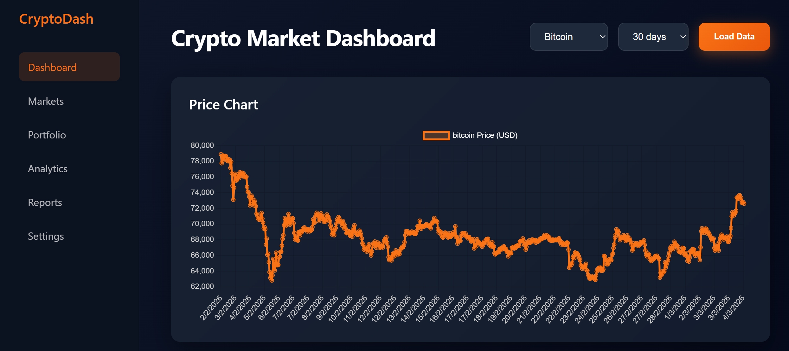
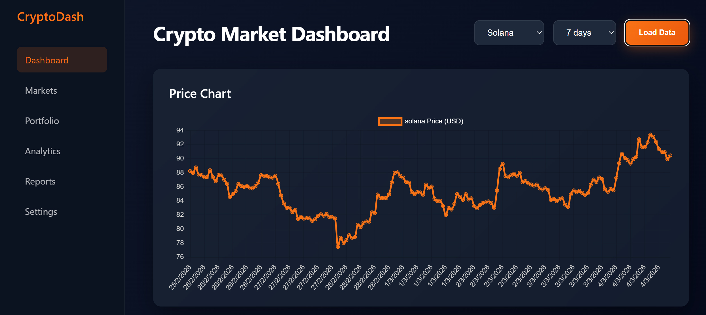
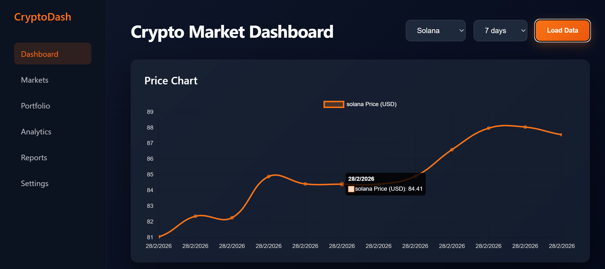

# Crypto Market Dashboard

Interactive dashboard built with React that visualizes cryptocurrency market data using the CoinGecko API.

The application displays price trends and market volume using dynamic charts with filters for cryptocurrency and time range.

---

# Live Demo

https://crypto-dashboard-react-one.vercel.app/

---

# Screenshots

### Dashboard

### Filters

### Chart Interaction (Zoom)

---

# Technologies Used

- React
- Vite
- Chart.js
- React Chart.js 2
- CoinGecko API
- Vitest (unit testing)
- React Testing Library
- CSS Grid & Flexbox

---

# Features

- Interactive cryptocurrency dashboard
- Real-time data from CoinGecko API
- Two dynamic charts:
  - Price chart (Line chart)
  - Market volume chart (Bar chart)
- Data filters:
  - Cryptocurrency selector
  - Time range selector
- Chart interactivity:
  - Zoom
  - Pan
- Responsive design for desktop and mobile
- Error handling for API requests
- Accessibility improvements using ARIA attributes
- Unit testing with Vitest

---

# Installation

Clone the repository:

git clone https://github.com/Fernando481917/crypto-dashboard-react.git

Install dependencies:

npm install

Run the development server:

npm run dev

Open the browser at:

http://localhost:5173

---

# Running Tests

Run the test suite:

npm test

Tests are implemented using Vitest and React Testing Library.

---

# Project Structure

crypto-dashboard-react
│
├── public
├── screenshots
│
├── src
│   ├── components
│   │   ├── PriceChart.jsx
│   │   ├── VolumeChart.jsx
│   │   ├── LiquidEther.jsx
│   │   └── LiquidEther.css
│   │
│   ├── App.jsx
│   ├── App.css
│   ├── App.test.jsx
│   ├── main.jsx
│   └── index.css
│
├── index.html
├── package.json
├── vite.config.js
└── README.md

---

# API Used

CoinGecko API

https://www.coingecko.com/en/api

Endpoint used:

/coins/{id}/market_chart

---

# Author

Fernando Sánchez
Frontend Developer
